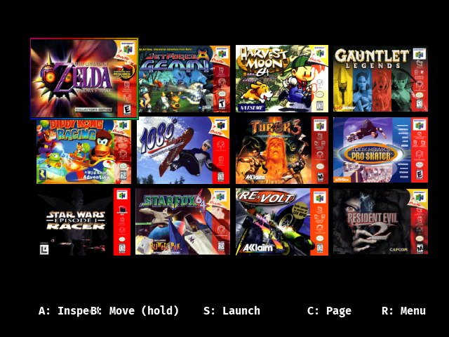
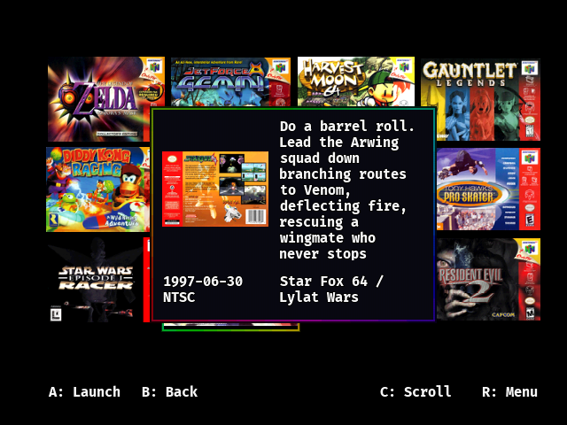
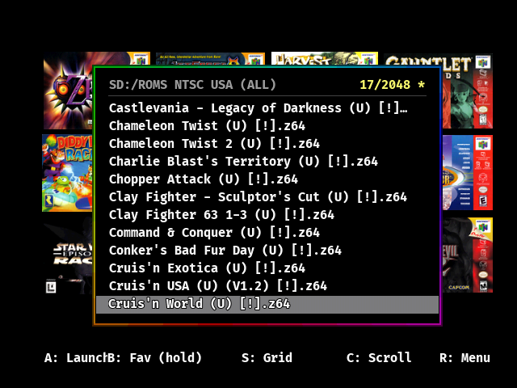

# FORK
Merges the large ROM fix from here: https://github.com/Kunstbanause/N64FlashcartMenu---EDx7-fix into the gallery mod N64ever.

  
___
# N64ever — Documentation

A personal fork of **N64FlashcartMenu** (by NetworkFusion & Polprzewodnikowy) focused on a
cover-art **Favorites Grid** front-end, a unified popup-based UI, and a baked-in box-art
library. Runs on SC64 / ED64 / 64drive via libdragon.

For the players.

> **Based on [N64FlashcartMenu](https://github.com/Polprzewodnikowy/N64FlashcartMenu) V0.3.2.**
> For the original project's README — upstream documentation, credits, and third-party
> licenses — see **[README-upstream.md](README-upstream.md)**.

---

## TL;DR — Build the ROM

Yes, it builds, and yes it's **Docker**. One command from the repo root:

```bash
./build-rom.sh
```

ROMs land in `output/`. First run also compiles the libdragon host tools into
`.hosttools/bin/` (a few minutes, one time only).

`output/OS64.v64` should be **≈ 1.9 MB**. That's the default now — covers load from the SD card.

**Cover art for the SD card** (one command, ~80 MB payload):

```bash
./tools/make_sdcard_boxart.sh
# then copy sdcard-boxart-full/menu/ onto your SD card root
```

**One-time setup**, if you've never built here before — the build image must exist under the
exact name `n64flashcartmenu-dev:latest`:

```bash
docker build -t n64flashcartmenu-dev:latest -f .devcontainer/flashcart/Dockerfile.sc64deployer .
```

**If the build fails after changing toolchain/image, nuke `build/` first** (it's root-owned by
Docker, so a plain `rm -rf build` won't work):

```bash
docker run --rm -v "$PWD:/project" n64flashcartmenu-dev:latest rm -rf /project/build
./build-rom.sh
```

> ⚠️ A fresh clone additionally needs libdragon **built** before the first ROM build — the repo
> pins the submodule but not its compiled `.a` files. See
> [§2 Fresh clones](#libdragon-submodule-and-fresh-clones).

See **[§2 Build system](#2-build-system)** for the full story.

---

## 1. Highlights

- **Favorites Grid** is the home screen — a masonry layout of cover art, not a file list.
- **Universal "More" menu** (R) — one menu for everything: launch, favorite, per-game art,
  grid settings, hardware, history, settings, file browser.
- **Inspect popup** (A) — cover + a 2+2 metadata block (name/developer over date/region) and a
  scrollable description sized to fit without scrolling for most games; sits on top of the grid.
- **Shrink-wrapped File Browser popup** — favorite ROMs (single or whole folders), launch,
  with a live favorites counter. Full **file management** (Copy/Move/Paste, Delete, Rename +
  Create folder via an **on-screen keyboard**), reachable even in an empty folder.
- **ROM boot** — optionally boot a chosen ROM on power-on after a cancellable art countdown
  (userland, no firmware autoboot; hold START at boot to disable).
- **60 fps render** with per-frame animations tuned to match; grid **Tile: Square/Box** sizing.
- **Baked-in box-art** — ~757 game-code art dirs compiled into the ROM (`rom:/boxart/...`),
  no SD art required for covered games. Region-fallback covers PAL/JP with US art.
- **Built-in text database** — 445 games with title/developer/dates/description (100% have a
  title + a back-of-box description). Binary-searched by 3-char base code.
- **Special editions** — ROMs that reuse another game's NUS code (e.g. *OoT Master Quest*,
  *Smash Remix*) get their own name/date/description + art, matched on the **filename**.
- **Build-type labels** — Demo / Prototype / Beta ROMs are recognised from their filename dump
  tags and flagged in Inspect (so a missing cover reads as "this is a demo", not a bug).
- **Blank-cart placeholders** — an uncovered game shows a realistic **label-removed** N64 cart
  (or 64DD disk) instead of a generic placeholder.
- **64DD disc support** — expansion discs (e.g. F-Zero X Expansion Kit) link to a base cartridge;
  the link is a manual, per-region **disclink** config (English ⇄ Japanese cache independently),
  and launching an unlinked expansion disc from Files **offers to link it**.
- **Animated screensaver** — idle cover-art marquee; also used as the live background of the
  redesigned **Menu Information** (one scrollable list in a rainbow popup, N64ever logo on top).
- **Cancel/abort** — B aborts a folder-favorite (full undo) or an A-Z sort mid-run.
- **Game Metadata register** — on-device diagnostic of which art/text sources exist per game.
- **Custom splash** — user PNG as the boot splash.
- **Everything is a popup over the grid** (except a few deliberately-black screens).
- **2048-favorite cap.**

---

## 2. Build system

### Toolchain
- Built in Docker image `n64flashcartmenu-dev:latest` (mips64-elf cross-tools only, currently
  GCC 14.4.0). Built from `.devcontainer/flashcart/Dockerfile.sc64deployer` — see
  [How to build](#how-to-build) step 0.
- libdragon is a submodule pinned to **`5cb976aa`** — do **not** bump it, see
  [libdragon submodule](#libdragon-submodule-and-fresh-clones).
  Its **library artifacts** (`libdragon.a`, `n64.mk`, linker scripts, headers, `libcart/cart.h`)
  are copied into `/opt/libdragon` before `make`.
- libdragon **host tools** are NOT in the image. Linux builds of
  `n64sym`, `n64tool`, `n64elfcompress`, `ed64romconfig`, `mkdfs` live in
  **`repo/.hosttools/bin/`** and are copied into `/opt/libdragon/bin` per build.

### How to build

**Requirements:** Docker, and a `libdragon/` that has been **built** at least once — a fresh
clone gets the source but not the `.a` files (see
[libdragon submodule](#libdragon-submodule-and-fresh-clones)).

**Step 0 — build the Docker image (one time).** `build-rom.sh` hardcodes the image name
`n64flashcartmenu-dev:latest` and does *not* build it for you. If it's missing, Docker will try
to pull it from Docker Hub and fail. Build it from the devcontainer Dockerfile:

```bash
docker build -t n64flashcartmenu-dev:latest -f .devcontainer/flashcart/Dockerfile.sc64deployer .
```

> If you already have this image under a different local tag (e.g. `n64menu-builder:latest`),
> just retag it: `docker tag n64menu-builder:latest n64flashcartmenu-dev:latest`

**Step 1 — build the ROM.** From the repo root:

```bash
./build-rom.sh
```

The script resolves its own directory, so it works from any cwd. Arguments are passed straight
through to `make` inside the container (e.g. `./build-rom.sh clean`, `./build-rom.sh sc64`).

On the **first** run it automatically invokes `build-tools.sh`, which compiles the libdragon
**host tools** from source inside the container into `.hosttools/bin/`. This takes a few minutes
and only happens once (it's skipped whenever `.hosttools/bin/mksprite` already exists).

Produces (under `output/`):
- `sc64menu.n64`  — SC64
- `OS64.v64` / `OS64P.v64` — ED64 / ED64 clone
- `menu.bin` — 64drive
- `N64FlashcartMenu.n64` — the raw ROM

> `OS64_FixLargeRom_CoverArtOnSD.v64` and `OS64-LITE-noboxart.v64` in `output/` are **not**
> Makefile targets — they're hand-renamed release copies and are never refreshed by a build.
> Don't trust their timestamps.

### Verified working

Last verified **2026-07-26** on Fedora (Linux 7.0.12), Docker 29.6.0:

- Clean build exits 0 and writes fresh ROMs. Getting there required `rm -rf build` first — see
  the stale-objects trap below.
- Default build → `output/OS64.v64` = **1.86 MB**, matching the known-good
  `OS64_FixLargeRom_CoverArtOnSD.v64` exactly.
- Large-ROM fix confirmed linked in: 6 × `0xaa55` EDX_KEY register writes in the ELF (the LL
  helpers are LTO-inlined, so they carry no symbols).
- `BAKE_BOXART=1` still parses and would build all 3160 sprites.
- `LIBDRAGON_VERSION` resolves to `5cb976a` (was `unknown`).

### Clean builds — when `build/` must go

`make clean` only removes the files it currently *lists*, so it does **not** rescue you from a
toolchain change. Delete the whole directory instead — **but `build/` is root-owned** (Docker
wrote it), so a plain host `rm -rf build` fails with *Permission denied*. Delete it from inside
the container:

```bash
docker run --rm -v "$PWD:/project" n64flashcartmenu-dev:latest rm -rf /project/build
./build-rom.sh
```

Two real failure modes seen in this repo, both fixed only by `rm -rf build`:

- **`No rule to make target '<abs-host-path>/.n64inst/.../utime.h'`** — a `.d` dependency file
  left over from a *host-side* (non-Docker) build that used `N64_INST=$PWD/.n64inst`. Those
  absolute host paths don't exist inside the container, so `make` gives up.
- **`lto1: internal compiler error: original not compressed with zstd`** — `build/` contains
  `.o` files produced by a *different GCC* than the container's (currently mips64-elf 14.4.0).
  LTO can't read the older objects and the link dies. Not a code bug; purely stale objects.

### ROM size: `BAKE_BOXART` (the small ROM is the correct one)

**Target: `OS64.v64` ≈ 1.9 MB — this is now the default.**

Why it matters: the krikzz EverDrive-64 X-series bootloader **cannot load a 48 MB `OS64.v64` at
all**. This is a boot-time ROM-size limit, not runtime RAM, and not caused by our large-ROM fix —
the *official* 48 MB release binary fails identically, while the 1.67 MB upstream menu and a
~1.9 MB stripped build boot fine. (Confirmed on an Analogue too: 8 MB baked still black-screened
at 48 MB.) That is the entire reason cover art moved to the SD card.

| | ROM | Boots on ED64 X-series | Cover art from |
|---|---|---|---|
| `BAKE_BOXART=0` **(default)** | ~1.9 MB | ✅ yes | SD card (`menu/metadata/...`) |
| `BAKE_BOXART=1` (legacy) | ~48 MB | ❌ **no** | baked into the DFS |

```bash
./build-rom.sh                      # 1.9 MB, covers from SD  <- what you want
BAKE_BOXART=1 ./build-rom.sh        # 48 MB legacy bake, SC64/64drive experiments only
```

**Do not "strip the art by hand."** Earlier builds got the small ROM by deleting
`assets/images/boxart/` — but that directory is **gitignored and the only copy** of the source
library, and it's what `tools/make_sdcard_boxart.sh` needs. The switch replaces that workaround.

Implementation notes, since two separate things had to be handled:
- The Makefile only expands `BOXART_SPRITES` when `BAKE_BOXART=1`.
- `mkdfs` packs the **entire** `filesystem/` tree regardless of the Makefile's `FILESYSTEM` list,
  so `build-rom.sh` also deletes `filesystem/boxart/` and forces a DFS repack when baking is off.
  That prune runs *inside* the container because Docker owns those files (see below).

**The `.cache` files do not affect ROM size.** They live on the SD card next to the PNGs, not in
the DFS. Pre-generating them only removes the on-console PNG decode so covers appear instantly.
If the ROM is large, the cause is baked sprites in the DFS — never the cache.

### Docker leaves root-owned files in the repo

The container runs as root, so `build/`, `filesystem/` and `.hosttools/` end up owned by `root`.
Consequences you will hit:

- Host-side `rm -rf filesystem/boxart` fails with *Permission denied* — that cleanup has to run
  inside the container.
- Don't compile host tools into `.hosttools/bin/`; `tools/make_sdcard_boxart.sh` builds into
  `.hostbin/` (host-owned) for exactly this reason.

### Cover art: making the SD card payload

```bash
./tools/make_sdcard_boxart.sh              # -> sdcard-boxart-full/  (~80 MB)
./tools/make_sdcard_boxart.sh /some/dir    # custom output location
```

Then copy the resulting **`menu/`** onto your SD card root, merging into any existing `menu/`.
Current library: **447 games, 1252 images** (front + back + cart), each with a pre-built `.cache`.

The script does three things:

1. Compiles [`tools/gen_boxart_cache.c`](tools/gen_boxart_cache.c) against the fork's **own**
   libspng submodule — using the same decoder as the firmware is what makes the output
   byte-identical to what the console would write.
2. Lays out `menu/metadata/<C>/<O>/<D>/{boxart_front,boxart_back,gamepak_front}.png`.
3. Pre-generates a `.cache` beside every PNG.

**Why the 3-char path.** A ROM code is 4 chars: bytes 0–2 are the game, byte 3 is the region.
`boxart.c`'s `try_metadata_png()` does a `path_pop` (strips one segment), so art placed at the
3-char level matches **any** region dump of that game — one cover serves E/P/J/U/… For each game
the script picks one source dir, preferring regions in order `E P J U A X F D I S`.

Only **front / back / cart** load from SD metadata (`cart.png` → `gamepak_front.png`).
`box3d`, `cart3d` and `logo` are DFS-or-custom only and are deliberately not copied.

> **Keep the PNGs on the card.** The menu reads the PNG's size before trusting the cache;
> deleting the PNGs invalidates every cache.

### Box-art SD cache (`.cache`)

Cover art is read from the SD card and cached as `.cache` files alongside each PNG. Format,
written big-endian by [`png_decoder.c`](src/utils/png_decoder.c):

| Field | Size | Value |
|---|---|---|
| `png_size` | u32 | byte size of the source PNG |
| `width` / `height` | u16 each | native PNG dims (≤ 158×158, never scaled) |
| `stride` | u32 | `width × 2` |
| pixels | `w·h·2` | RGBA5551, alpha bit always 1 |

Header is 12 bytes; total file is `12 + w·h·2`. `load_cache` rejects the cache unless `stride`
matches exactly, and re-checks `png_size` against the live PNG — so the cache is **self-healing**:
swap a cover and the stale entry is discarded and rebuilt on device.

Verified against a known cover (DK64, `N/D/O`): PNG 158×111, 48530 bytes → cache header
`png_size=48530 w=158 h=111 stride=316`, file size 35088 = `12 + 158·111·2`. Exact.

> The generator was lost when the project moved into this fork and was **restored 2026-07-26**
> from the original session transcript — it now lives at
> [`tools/gen_boxart_cache.c`](tools/gen_boxart_cache.c) and is tracked in git, not a scratchpad.

### libdragon submodule and fresh clones

**The pin:**

```
libdragon @ 5cb976aab11eb30622c33b112c120a1107eedb5e   (branch: preview, 2026-05-12)
"revert workarounds in rdpq_set_tile_size_fx and ROUND_DOWN"
```

**What was wrong.** `.gitmodules` declared `libdragon`, but `.gitignore` contained `/libdragon`,
which stopped git from ever recording a gitlink — the declaration was inert. Only three gitlinks
existed (libspng, minimp3, miniz), and `git clone --recursive` produced **no `libdragon/` at
all**. On top of that, `libdragon/.git` pointed at a `.git/modules/libdragon` that didn't exist,
so the local tree was orphaned: `git -C libdragon describe` failed and `build-rom.sh` silently
fell back to `LIBDRAGON_VERSION="unknown"` (which is what Menu Information showed).

**How the revision was recovered.** The orphaned tree carried no git metadata, so the commit was
identified by diffing it against upstream `preview`: `include/`, `src/`, `n64.mk` and `n64.ld`
all match `5cb976aa` byte-for-byte (only untracked `.o`/`.d`/`.a` build artifacts differ).

**What was done.** `/libdragon` removed from `.gitignore`; the existing tree re-attached to
upstream at that commit and absorbed into `.git/modules/libdragon` — deliberately *without*
`rm -rf libdragon`, so the prebuilt `.a` files `build-rom.sh` depends on survived. All four
submodules now register, and `LIBDRAGON_VERSION` resolves to `5cb976a` instead of `unknown`.

> **Fresh clones still need libdragon built first.** `build-rom.sh` copies **prebuilt artifacts**
> out of `libdragon/` (`libdragon.a`, `libdragonsys.a`, `n64.ld`, `dso.ld`, `rsp.ld`). Those are
> build outputs, not source, so a freshly-checked-out submodule has none of them. Until
> `build-rom.sh` learns to build libdragon on demand, do it once by hand:
>
> ```bash
> git submodule update --init
> cd libdragon && make clobber -j && make libdragon tools -j && make install tools-install -j
> ```
>
> This is the remaining gap — the gitlink is fixed, the bootstrap is not.

> ### ⛔ Do NOT bump libdragon
>
> This fork is pinned to `5cb976aa` **on purpose**. Newer libdragon renamed the COP0 status
> macros, and [`src/boot/boot.c:155`](src/boot/boot.c#L155) uses
> `C0_STATUS_CU1 | C0_STATUS_CU0 | C0_STATUS_FR`. Building against a newer libdragon
> (e.g. `43c67df`) fails there. This was hit and diagnosed during the original port — it is
> a fork-vs-libdragon API drift, unrelated to the large-ROM fix.

**To fix properly:**

1. Remove `/libdragon` from `.gitignore`.
2. Register the gitlink at the verified commit. Prefer the **non-destructive** route — the local
   tree already contains prebuilt `libdragon.a`/`libdragonsys.a` that `build-rom.sh` depends on,
   and `rm -rf libdragon` would throw them away:
   ```bash
   rm libdragon/.git                                  # stale pointer to a missing gitdir
   git -C libdragon init -q
   git -C libdragon remote add origin https://github.com/DragonMinded/libdragon
   git -C libdragon fetch --depth 1 origin 5cb976aab11eb30622c33b112c120a1107eedb5e
   git -C libdragon reset --hard FETCH_HEAD           # untracked .a files survive this
   git add libdragon                                  # now creates the 160000 gitlink
   ```
3. Extend `build-rom.sh` to build libdragon when `libdragon/libdragon.a` is missing, instead of
   assuming prebuilt artifacts are present. Without this, a fresh clone still won't link — the
   devcontainer's `postCreateCommand` shows the needed steps.
4. Confirm with a throwaway `git clone --recursive` that the clone builds before trusting it.

### Build number / versions
`MENU_VERSION` (Makefile, default a build number e.g. `"300"`) is compiled into the credits
("N64ever build: NN"). Bump it per build. `BUILD_TIMESTAMP`, `LIBDRAGON_VERSION` (from the
libdragon submodule) and `MENU_BASE_VERSION` (the upstream N64FlashcartMenu tag this fork is
based on, e.g. `V0.3.2`, via `git describe --tags --abbrev=0`) are all derived at build time by
`build-rom.sh` and shown in **Menu Information**.

### Build hygiene (automatic)
`build-rom.sh` strips `.DS_Store` and any **orphan `*.sprite`** (a baked sprite whose source PNG
was removed/renamed) from `filesystem/` before packing — `mkdfs` packs the whole tree, so orphans
would otherwise silently bloat the ROM (this once added ~10 MB). Surgical, so incremental builds
stay fast.

### Build traps (important)
- **Stale ROM trap:** the `%.z64` recipe runs `n64sym` first; if any host tool is missing the
  recipe aborts *before* copying to `output/`, leaving `output/sc64menu.n64` STALE while
  `[Z64]` still prints. Always verify freshness (`stat` the .elf vs output) — this silently
  shipped identical ROMs for several builds once.
- **Stale DFS trap:** `mkdfs` only repacks `build/*.dfs` when a `filesystem/` asset is *newer*.
  If art is copied in with preserved (older) mtimes, the DFS won't repack and games show no
  baked art. After touching baked art: `rm build/*.dfs` and rebuild.
- **Non-deterministic:** builds aren't byte-reproducible. Verify changes via the ELF, not SHA.
- `n64sym` (debug symbols) is non-fatal in this environment.
- **Stale object trap:** objects in `build/` from a different toolchain break the LTO link, and
  `.d` files from a host-side build reference absolute host paths that don't exist in the
  container. `make clean` does not fix either — use `rm -rf build`. See
  [Clean builds](#clean-builds--when-build-must-go).
- **Silent 25× ROM bloat (now guarded):** baking the art library into the DFS gives a 48 MB ROM
  that **cannot boot on ED64 X-series**. `BAKE_BOXART` now defaults to `0`, and `build-rom.sh`
  prunes stale `filesystem/boxart/` — but if you ever pass `BAKE_BOXART=1`, check the size. See
  [ROM size](#rom-size-bake_boxart-the-small-rom-is-the-correct-one).
- **Root-owned files:** Docker writes `build/`, `filesystem/` and `.hosttools/` as root; host-side
  cleanup of those paths fails with *Permission denied*. Do such cleanup inside the container.

---

## 3. UI overview & controls

The **Grid** is always the base layer. Other views render as popups over it (a few use a
solid black background — see §6).

### Grid (home)
| Button | Action |
|---|---|
| D-pad / stick | Move selection — vertical **wraps** top↔bottom; horizontal **wraps end-to-end** (left at the leftmost tile → last tile of the row above; right at the rightmost → first of the row below) |
| C ▲▼ | Page up/down a full screen — **wraps** top↔bottom (clamps to the edge row first, wraps on the next press) |
| C ◀▶ | Jump A-Z letter groups (when sorted, wraps Z↔A) / first–last tile of the row (unsorted) |
| A | **Inspect** the selected game |
| S (Start) | **Launch** immediately |
| B (hold) | Enter **Move mode** (reorder; hold R to unfavorite; D-pad to move) |
| R | Open the **universal Menu** |

Empty grid shows a hint: hold-B on a ROM in the File Browser, or select a folder → menu →
"Fav inside folder".

### Inspect popup
`A: Launch · B: Back · R: Menu · C ▲▼` (scroll). A compact **4:3 window over the grid** (no black
fill): cover at left, a vertical divider, then below a horizontal divider a **2+2 metadata block**
— **name + developer** (may be long) over **date + region** (short), each vertically centred — and
the description (centred when it fits, top-aligned + scrollable when it doesn't). **Demo / Prototype
/ Beta** builds (detected from the ROM filename's dump tags) are labelled under the date, and
Aleck64 / iQue variants are flagged in the region slot. You can add your own entries, description
and image per game via `gameconfigs/` (see §5).

### Universal "More" menu (R from grid; R from inspect)
Order:
1. Launch · Unfavorite · Game settings · Game Metadata
2. Presents As · Grid settings · `Favorites: X/2048`
3. Menu Settings · Menu Information · Hardware
4. History · File Browser

- **Favorite/Unfavorite** is *deferred*: it flips the label and keeps the game on the grid;
  the change commits when you close the menu (so accidental unfavorites can be undone).
- **Presents As** (per-game): Region art (Auto / NTSC / PAL / NTSC-J) + per-context image view
  (Grid / Inspect / Load) + Reset to defaults. Only the *Grid* view (and region) reload the
  tile; Inspect/Load don't flash the grid.
- **Grid settings** (global): Grid/Inspect/Load image view, Set tiles square. Grid-view changes
  reload covers live.
- **Game Metadata**: see §7.
- Sub-views reopen this menu (at the row/submenu you left from) when they close.

### File Browser popup (Menu → File Browser, or R on an empty grid)
2/3-screen popup, path + `X/128 *` counter in the header.
| Button | Action |
|---|---|
| A | Launch ROM / enter folder / open file |
| S | Back to Grid |
| R | Open the More menu for the entry |
| B | Up a directory (double-tap at root → back to the Menu); **hold on a ROM = favorite** |
| B-hold + C/D-pad sweep | Mark a range of favorites (visual first, committed on release) |
| C ◀▶ | Horizontally scroll a long selected name |

Favorited ROMs show a trailing `*`. On a **folder**, the More menu offers **Fav inside folder /
Unfav inside folder** — a progress popup shows during the pass and **B cancels it (full undo —
nothing is committed)**. The More menu (R) opens **even in an empty folder**, so File management
(below) is always reachable.

**File management** (More → File management) operates on the selected entry / current directory:
- **Copy / Move** — capture the entry, then **Paste** into any other folder. Move is instant
  (same-volume `f_rename`); Copy shows a **rainbow progress bar** and **B cancels** it (the source
  is never touched). Won't overwrite an existing name.
- **Rename / Create folder** — open the **on-screen keyboard** (D-pad/stick to move, **A** type,
  **B** backspace, Shift toggles case, Space; **START** = OK, **R** = cancel). Rename uses
  `f_rename`; Create folder uses `f_mkdir`.
- **Delete**, **Show properties**, **Set current directory as default**.
- **Show / Hide file size** — a **global** on/off (persisted). When on, every file's size shows
  in a left gutter in the browser list, in all folders.
- **Set ROM boot** / **ROM boot: Enabled/Disabled** — see §3 ROM boot, below.

Launching an **unlinked 64DD expansion disc** (E-prefix code, needs a base cartridge) **offers to
link it** — now **in the rainbow popup itself** (not a separate full-screen list): a `LINK … → pick
its base ROM` banner, **A** links + boots, **B** goes up a directory, **R** cancels. See §5 (disclink).

### ROM boot (power-on convenience)
**File management → Set ROM boot** marks the selected ROM and enables ROM boot. On the next
power-on the menu (still in userland — no firmware autoboot) shows that ROM's **Load art (or the
cart placeholder)** with a short **countdown**: do nothing and it boots, **START** boots now, **B**
cancels to the grid. **Hold START at power-on** to disable ROM boot entirely (the boot-loop escape
hatch). Toggle persistence via **ROM boot: Enabled/Disabled**.

### History popup (Menu → History)
Files-style list: `A: Launch · B: Fav (hold)`, with `*` on favorited entries.

### Hardware (Menu → Hardware)
Controller Pak manager, Time (RTC), Flashcart information, N64 information.

### Settings (Menu → Menu Settings)
Always-open editable popup over the grid: toggles + **Reset settings** (with confirm) + the
**default directory** shown at the bottom of the box. Toggling **PAL60** triggers a 10-second
countdown confirmation (auto-reverts if the display breaks).

### Screensaver (idle marquee)
A scrolling cover-art marquee that fills the screen on idle (rows alternate direction, recycle
infinitely). Trigger: idle timeout, or hold **L+R**; any button wakes it. **Settings →
Screensaver** toggles it on/off. Caps at **5 rows** of covers (a RAM limit — see §10). The same
marquee is reused as the **live background of Menu Information**.

### Menu Information (Menu → Menu Information)
The N64ever **credits**, as **one scrollable list** inside the system black popup + animated
rainbow rim, drawn over the live screensaver. The **N64ever logo** sits at the top, then build /
SDK info, fork credits, license, and the OSS-library list (no longer a separate L/Z page).
`Up/Down: scroll · B: exit`.

---

## 4. Favorites & history

- Stored as **two separate files** under the user-data folder:
  - Favorites → **`sd:/menu/n64ever/favorites.ini`** (group `[favorite]`)
  - History → **`sd:/menu/n64ever/history.ini`** (group `[history]`)
- Per-entry keys: `N_primary_path`, `N_secondary_path`, `N_type`.
- **Migration:** on first boot, if the new files are absent, the pre-split combined
  **`sd:/menu/history.ini`** (which held both `[favorite]` and `[history]`) is read and the
  lists are written out into the two new files. The old file is left in place (not deleted).
- Each list saves independently: favoriting writes only `favorites.ini`, launching a ROM
  writes only `history.ini`.
- **Favorites cap: 2048** (`FAVORITES_COUNT`). Adding past the cap drops the oldest (bounded
  insert). History cap: 64 (`HISTORY_COUNT`). Performance scales with the actual count, not the cap.
- **Folder-favorite is abortable**: B during the pass fully undoes it (the in-RAM adds aren't
  saved until the end, so a cancel just reloads the unchanged list from SD).
- **A-Z sort** (Favorites submenu → *Run Once: Sort A-Z*, or the *Always sort A-Z* setting):
  re-derives every favorite's sort key (an SD read per uncached game). Holding **B** during the
  blocking sort cancels it before any reorder (the list is left untouched).
- Auto-import: ROMs dropped into `/Favorites` or `/Favourites` on the SD are added on grid entry.

---

## 5. Files N64ever reads / writes (on SD)

All under the flashcart's storage prefix (e.g. `sd:/`). `MENU_DIRECTORY = /menu`.

| Path | R/W | Purpose | Format |
|---|---|---|---|
| `menu/config.ini` | R/W | Settings | INI, `[menu]` / `[autoload]` / `[menu_beta_flag]` |
| `menu/n64ever/favorites.ini` | R/W | Favorites list | INI `[favorite]`, `N_primary_path` / `N_type` keys |
| `menu/n64ever/history.ini` | R/W | Recently-played list | INI `[history]`, `N_primary_path` / `N_type` keys |
| `menu/history.ini` | R | **Legacy** combined favorites+history (migrated on first boot) | INI `[favorite]` + `[history]` |
| `menu/n64ever/splash.png` | R/W | Custom boot splash | PNG ≤ 640×480 (RGB8 → RGBA16) |
| `menu/n64ever/audio/*.wav64` | R | Override grid SFX (`grid_move`, `grid_enter`, `grid_back`, `launch`) | wav64 |
| `menu/n64ever/gameconfigs/<stem>.ini` | R/W | Per-ROM config (CIC, save, TV, presents-as, per-game image views) | INI, `[presentation]` etc. (`<stem>` = ROM filename w/o ext) |
| `menu/n64ever/gameconfigs/<stem>.json` | R | Legacy custom metadata (key/value + description) | JSON |
| `menu/n64ever/gameconfigs/<CODE>.meta.ini` | R | User metadata override (per game code) | INI `[meta]` |
| `menu/n64ever/disclink_jp.ini` / `disclink_us.ini` | R/W | **64DD disc → base-ROM link**, per region | lines `CODE = sd:/path/to/base.n64` |
| `menu/n64ever/gameconfigs/<stem>-{front,back,3dbox,cart,3dcart,logo}.png` | R | Per-game custom art override | PNG (≤1024²) |
| `menu/metadata/<c>/<u>/<u>/<d>/metadata.ini` | R | SD metadata DB entry | INI `[meta]` |
| `menu/metadata/<c>/<u>/<u>/<d>/boxart_front.png` (+ back/left/right/top/bottom, gamepak_front/back) | R | SD box art | PNG ≤ 158×158, RGB8 |
| `menu/metadata/homebrew/<title>/…` | R | Homebrew art/meta (code `?ED?`), keyed by 20-char ROM title | as above |
| `menu/boxart/CCCC.png` | R | **Legacy** flat boxart | PNG (deprecated) |
| `<rom>.meta` / `<rom dir>/metadata.ini` / embedded ZIP `metadata.ini` | R | Per-ROM metadata | INI `[meta]` |
| saves folder (when "use saves folder" on) | R/W | Game saves | `.sav/.eep/.sra/.srm/.fla` |
| cheat files | R | Cheats | `.cht/.cheats/.datel/.gameshark` |

**Folder rename:** the user-data subfolder is **`menu/n64ever/`** (formerly `menu/custom/`).
All four `gameconfigs/` types and the per-game art PNGs still fall back to the old
`menu/custom/gameconfigs/` location on read, so existing data keeps working.

**Retired:** `menu/n64ever/background.png` (the behind-the-grid background image feature was
removed; the image-viewer "set" action now writes `splash.png` instead).

### Migrating from stock N64FlashcartMenu

Switching an existing stock-menu SD card to N64ever needs **no manual steps** — drop in the
N64ever ROM and boot. Everything carries over automatically:

| Stock file | What N64ever does | Action needed |
|---|---|---|
| `menu/config.ini` | Same path & `[menu]` format. N64ever reads it as-is; its extra keys (`use_custom_files`, `always_sort_az`, …) default in if absent; stock-only keys are ignored (and dropped on the next save). | None |
| `menu/history.ini` (stock's combined list) | **Favorites & history are NOT carried over.** On the first boot after migrating to a release, N64ever does a **one-time favorites/history reset** so you land on the clean empty-grid greeting (which carries the how-to). It's gated by a data-version marker `menu/n64ever/.migrated.vN` (independent of the build number), so it fires exactly once per migration; the legacy file is left untouched on the card. | None — re-add your favorites |
| `menu/custom.font64` | Same path. | None |
| Per-game ROM config (`<rom>.ini` next to the ROM, or stock `gameconfigs/`) | Read in place; new writes go to `menu/n64ever/gameconfigs/`, with the old `menu/custom/gameconfigs/` kept as a read fallback. | None |
| Saves (`<rom>.sav`, saves folder), cheats, Controller-Pak dumps | Standard paths, untouched. | None |
| `menu/cache/`, baked art | Regenerated / baked into the ROM. | None |

Notes:
- The migration is **one-way-friendly**: going *back* to the stock menu still works — it simply
  ignores the `menu/n64ever/` folder and N64ever's extra `config.ini` keys.
- SD `menu/metadata/` art still works as an override/supplement but you probably won't feel you need it.
- A **stale save** from an earlier save-type detection can make a specific game fail with
  "Error … during save loading" (the on-SD `.sav` size no longer matches the detected save
  type). Fix: delete that game's `.sav` (it will be recreated empty) — or set the correct
  type under **Game details → Save Type**.

### `[meta]` INI keys (metadata.ini / `.meta` / embedded)
`name`, `author`, `release-date`, `osi-license`, `website`, `age-rating` (int), `short-desc`
(the description shown in Inspect; truncated to 511 chars).

### `config.ini` `[menu]` keys (selection)
`pal60`, `splash_enabled`, `background_image_enabled` (legacy), `custom_splash_enabled`,
`grid_square_tiles`, `image_view_grid` / `image_view_inspect` / `image_view_load` (int 0–5),
`show_file_size`, `default_directory`, `use_saves_folder`, `soundfx_enabled`, `bgm_enabled`,
`loading_progress_bar_enabled`, `reboot_rom_enabled`, …

### 64DD disc linking (disclink)
64DD **expansion** discs (E-prefix code, e.g. `EFZJ`/`EFZE` = F-Zero X Expansion Kit) can't boot
alone — they need a base cartridge. N64ever links them via two hand-editable, **per-region** files:
- `menu/n64ever/disclink_jp.ini` — Japanese discs (game-code 4th char `J`)
- `menu/n64ever/disclink_us.ini` — everything else

Each line maps a **disc game-code → full base-ROM path**, e.g.
`EFZE = sd:/All n64/F-Zero X (USA).n64`. The English (`EFZE`→US base) and Japanese (`EFZJ`→JP base)
versions therefore cache **independently** (the old single combined-favorite link could only hold
one). The override takes precedence over any cached favorite link at launch. Launching an unlinked
expansion disc opens the link picker; picking a base ROM writes it here. The brittle auto-pairing
(family match) is retired in favour of this explicit config.

---

## 6. Baked-in assets (in the ROM, `rom:/`)

Compiled from `assets/` → `filesystem/` → DFS via `mkdfs`.

| Path | Purpose | Format |
|---|---|---|
| `rom:/PixelMplus12-Bold.font64` | UI font (**default**; Firple-Bold = legacy/fallback, settings toggle) | mkfont, monochrome, **fixed charset** |
| `rom:/Firple-Bold.font64` | Legacy/fallback UI font (covers accents PixelMplus lacks) | mkfont, compressed |
| `rom:/*.wav64` | Built-in SFX + `bgm.wav64` | wav64 |
| `rom:/splash.sprite` | Built-in boot splash | sprite |
| `rom:/credits_logo.sprite` | N64ever logo (top of Menu Information) | RGBA32 sprite |
| `rom:/placeholder-cart.sprite` | No-art fallback: **blank** (label-removed) N64 cart | RGBA32 sprite |
| `rom:/placeholder-disc.sprite` | No-art fallback: **blank** (label-removed) 64DD disk | RGBA32 sprite |
| `rom:/boxart/<CODE>/<type>.sprite` | Baked box art (incl. private `art_code` dirs `ZMQE`, `SMRX`) | RGBA16 sprite, LZ4 |
| built-in metadata DB | name/dev/date/desc, binary-searched by 3-char base code | compiled-in table |

### Backgrounds / solid screens
- Grid, Files, and most popups use a **solid** background.
- **Black background (deliberate):** Controller Pak management **edit**.
- **Menu Information** draws its rainbow popup over the **live screensaver** (not black).
- **Grid backdrop:** N64 / Flashcart / RTC-display popups, Game settings.

---

## 7. Metadata & art resolution

### Text metadata (name / developer / date / description) — resolution order
0. **Special edition** filename match (`game_special.c`) — wins over everything below for
   shared-code ROMs (see "Special editions").
1. Embedded/external per-ROM `.meta` / `metadata.ini` / ROM-embedded ZIP `[meta]`.
2. SD metadata DB `menu/metadata/<c>/<u>/<u>/<d>/metadata.ini`.
3. User override `menu/custom/gameconfigs/<CODE>.meta.ini`.
4. Built-in compiled database (binary search on 3-char base code).
5. Custom JSON (`<stem>.json`).
If none: "Unknown" / "No description available".

### Box art — resolution order (per requested type, via a fallback chain)
For each candidate type in the chain: **custom-folder PNG → baked ROM sprite → SD metadata PNG**.
- Chains differ per requested view (box-front prefers front→3D→back→cart→…; cart prefers
  cart→3D-cart→logo→box; etc.).
- **Region fallback (baked art):** if the exact 4-char code dir has no sprite, the loader tries
  the same title under other region bytes (`E, P, J, U, A, X, …`). So a PAL ROM with no PAL art
  uses the US cover. Box front/back honor the per-game region (Presents As); cart/3D/logo are
  region-agnostic.

### Special editions (shared-code ROMs) — filename-keyed override
Some ROMs **reuse another game's 4-char NUS code**, so the code-keyed text DB and baked art
would mistake them for the base game. These are disambiguated on the **ROM filename** instead.
- Defined in **`src/menu/game_special.c`** (`specials[]`): each entry lists lowercase **tokens**
  that must ALL appear in the filename (case-insensitive), plus its own metadata and an
  **`art_code`** (a private 4-char DFS key under `rom:/boxart/<art_code>/`).
- A match **beats** both the DB (metadata) and the colliding code (art): `boxart_init` redirects
  the DFS lookup to `art_code`, so the base game's art is never shown for the special edition.
- The match is computed once per favorite (`load_rom_info_into`) and cached as a 1-byte index on
  the grid entry. Region-agnostic — one entry covers every regional/version filename.
- **Current entries:**
  - **OoT Master Quest** (tokens `master`+`quest`, art `ZMQE`) — ships under the OoT codes
    `CZLE`/`NZLP` with an identical header title; only the filename distinguishes it.
  - **Smash Remix** (tokens `smash`+`remix`, art `SMRX`) — a Super Smash Bros. 64 gameplay mod
    under the base `NAL*` codes.

### No-art placeholder (blank carts)
When no art resolves at all, a tile/inspect/load view draws a **blank label-removed cartridge**
render: `rom:/placeholder-cart.sprite` for ROMs, `rom:/placeholder-disc.sprite` for 64DD disks
(picked by disk type). Both were produced by inpainting the printed label off a real angled
cart/disk render, so an uncovered game still looks like a genuine (blank) N64 cart or 64DD disk.

### Loading strategy (grid)
- **ROM info/metadata** loads for **every** favorite (selected → visible → offscreen, one per
  frame) and is never blocked by a decoding cover.
- **Cover art** loads **lazily** — only the selected game + visible rows (±1); offscreen art
  loads as rows scroll into view (one decode at a time).
- The boxart cache persists across grid re-entries (only re-decodes when the favorites set or
  the grid image-view changes; the just-edited game is refreshed individually).

### Game Metadata register (Menu → Game Metadata)
Per selected game, shows the game code + region and, for each of the 6 art types, whether it
resolves from **ROM** (baked, incl. region fallback) or **Custom**, plus presence of **Text**
metadata (ROM embedded / SD database / Custom). It's the on-device diagnostic for "why is this
game blank".

---

## 8. Formats / sizes / encodings (quick reference)

| Thing | Constraint |
|---|---|
| Display | 640×480, ~32px/24px overscan margins |
| Baked boxart source PNG | ≤ 158×158, RGB8 → RGBA16 sprite |
| SD metadata boxart PNG | ≤ 158×158 (decoder limit; larger silently fails) |
| Splash PNG | ≤ 640×480 |
| Per-game custom art PNG | ≤ 1024×1024 |
| Text fields | ASCII only — font has a **fixed charset**; transliterate accents/CJK/™ |
| `^` in any text | **Forbidden** — it's the rdpq style-escape; corrupts rendering |
| Sprite asset | magic `DCA`, version `'5'`, LZ4 (algo 1), RGBA16 |
| INI | `key = value`, `[group]` sections; booleans, ints, strings |

---

## 9. Source map (where things live)

- `src/menu/views/games_grid.c` — the Grid, Inspect, universal More menu, Game Metadata
  register, History modal, splash, lazy art loading.
- `src/menu/views/browser.c` — File Browser (full list + shrink-wrapped popup), folder-fav.
- `src/menu/views/load_rom.c` — "Game settings" + ROM loading screen.
- `src/menu/views/{system_info,flashcart_info,rtc,cpakfs_manager,credits}.c` — hardware/info.
- `src/menu/views/settings_editor.c` — settings popup.
- `src/menu/ui_components/{boxart,context_menu,background,common,file_list}.c` — UI primitives.
- `src/menu/{rom_info,rom_custom,game_metadata,bookkeeping,settings,sound}.c` — data layer.
- `src/menu/game_special.c` — filename-keyed special-edition table (shared-code ROMs).

---

## 10. Known bugs & limitations

**Performance / memory**
- Large favorite counts are heavy: `rom_config_load` per game does ROM-header read + DB search +
  gameconfigs `.ini` + `.meta` + an **embedded-ZIP scan**; and `fav_entry_cache` is a sizable
  per-game struct (description buffer etc.).

**Build**
- See §2 build traps (stale ROM, stale DFS, non-determinism, `n64sym` skipped).

---

## 11. Tips & tricks

**Favorites**
- **Favorite a whole folder:** in Files, select a folder → R → *Fav inside folder*. **Press B
  during the pass to cancel** (nothing is committed). *Unfav inside folder* removes them.
- **Hold B on a ROM** in Files to favorite it directly; B-hold + sweep marks a range.
- **A-Z sort:** Favorites submenu → *Run Once: Sort A-Z* (or the *Always sort A-Z* setting). On a
  big library it reads each game once — **hold B to cancel** if it's taking too long.
- **C ▲▼ on the grid** jumps between A-Z letter sections (when the list is sorted).

**Navigation**
- **Double-tap B** at the Files root jumps straight back to the grid.
- **A = Inspect, Start = launch now** from the grid. In Inspect, **C ▲▼ scrolls** the description.

**64DD discs**
- Launching an **unlinked expansion disc** (e.g. F-Zero X Expansion Kit) from Files **offers to
  link** it — browse anywhere for the base cartridge, then it boots combined.
- For exact control, hand-edit `menu/n64ever/disclink_{jp,us}.ini`: `CODE = sd:/path/to/base.n64`.
  English and Japanese versions of a disc link **independently**.

**Look & feel**
- **Screensaver:** hold **L+R** to start it now (or wait for idle); any button wakes it. Toggle in
  Settings.
- **Custom boot splash:** drop a PNG (≤640×480) at `menu/n64ever/splash.png`.
- **Per-game art / text / settings:** `menu/n64ever/gameconfigs/` (custom PNGs, `.meta.ini`).
- **Custom grid sounds:** drop `*.wav64` in `menu/n64ever/audio/`.
- **Fonts:** the default is **PixelMplus**, a pixel/8-bit-style typeface chosen for its **retro,
  N64-era appeal**. The original **Firple** font is still available as a **Legacy font** (Settings
  toggle) — it also covers a few accented (Latin-Extended) glyphs PixelMplus lacks.

**Recovery**
- **Reset settings:** Settings → *Reset settings* (with confirm). Favorites/history are separate
  files under `menu/n64ever/` — back them up by copying that folder.
- A game failing with a **save-loading error** usually means a stale `.sav` of the wrong size —
  delete it (recreated empty) or set the correct **Save Type** in Game details.

---

## 12. Changelog 

** Initial release, you just read it.**
